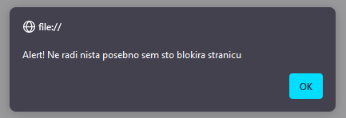
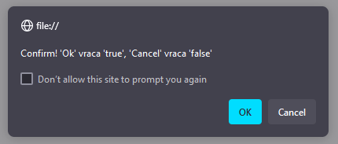
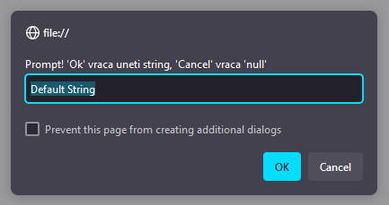

# Vežbe | 9. termin

## Sadržaj

- [Regularni izrazi](#regular-expressions)
- [Primeri validacije](#primeri-validacije)
- [Modali](#modali)


## Regular Expressions

Regularni izraz (_regex_) je mehanizam kojim proveravamo da li **string** sadrži **podstring** koji je u odgovarajućem šablonu.

U _JavaScript_-u taj šablon definišemo kao objekat korišćenjem konstruktora `RegExp` klase ili _regex_ literala.

```js
// Literal | Sintaksa za opis šablona se piše između dva slash karaktera
let regex1 = /[A-Z]+/             

// Konstruktor | Sintaksa za opis šablona se piše kao string koga prosleđujemo konstruktoru
let regex2 = new RegExp("[A-Z]+") 
```

_Napomena: Dva spojena slash karaktera (`//`) predstavljaju komentar, ali ako između njih postoji nešto onda predstavljaju regex literal._

Jedan regularni izraz opisuje kakav niz karaktera tekst treba sadrži. Korišćenjem funkcije `test` dobijamo `true` ako takav niz karaktera postoji (i onda možemo reći da tekst odgovara šablonu), u suprotnom dobijamo `false` (ne odgovara šablonu).

```js
regex1.test("Tekst za proveru") // => true/false
```

### Opis jednog karaktera

Šablon podstringa se sastoji od opisa pojedinačnih karaktera koji se jedan za drugim trebaju naći u podstringu.

Svaki karakter možemo opisati kao konkretan karakter:

```js
// Vraća true za stringove sa podstringom "logija"
let reg = /logija/
reg.test("Psihologija")  // => true
reg.test("123logija456") // => true
reg.test("BIOLOGIJA")    // => false
```

a svaki karakter možemo opisati i skupom karaktera koji on može biti:

```js
let reg = /[MGP]ost/
reg.test("Most") // => true
reg.test("Gost") // => true
reg.test("Post") // => true
```

skup moze biti i opseg:

```js
let reg = /Point [A-F]: [0-9], [0-9]/
reg.test("Point B: 1, 7") // => true
reg.test("Point C:1, 7")  // => false
```

ili kombinacija oba nacina:

```js
// Heksadecimalna cifra
let reg = /[0-9a-fABCDEF]/
reg.test("7") // => true
reg.test("b") // => true
reg.test("B") // => true
```

Postoji i način da označimo da krakter može biti bilo šta (tačka):

```js
// Tri bilo koja karaktera
let reg = /.../
reg.test("ab")   // => false
reg.test("ab12") // => true
```

ali onda da bismo predstavili tačku kao karakter koristimo _backslash_ kao _escape_ karakter:

```js
let reg = /[0-9]\.[0-9]/
reg.test("0.3") // => true
```

### Opis broja karaktera

Nakon što opišemo jedan karakter možemo označiti i koliko se takvih karaktera može uzastopno naći.

Nula ili jedan (`?`):

```js
let reg = /#?[0-9]/
reg.test("#1") // => true
reg.test("1")  // => true
```

Nula ili više (`*`):

```js
let reg = /0*[1-9]/
reg.test("009") // => true
reg.test("9")   // => true
```

Jedan ili više (`+`):

```js
let reg = /lo+l/
reg.test("ll")     // => false
reg.test("lol")     // => true
reg.test("loooool") // => true
```

Tačan opseg, min i max:

```js
// Hex kod boje u CSS-u
let reg = /#[0-9a-f]{6,8}/
reg.test("#35f21")     // => false
reg.test("#35f21b")    // => true
reg.test("#35f21bcc")  // => true
reg.test("#35f21bccc") // => true (ima 9 karaktera!)

// Ukoliko se izostavi max onda nema gornje granice za broj ponavljanja; {x,}
// Kada su min i max isti možemo zapisati samo jedan broj; {x} umesto {x,x}
```

### Pozicija podstringa

U dosadašnjim primeraima podstring koji proveravamo se mogao naći bilo gde u stringu, pa se tako ispred i iza podstringa mogao nalaziti bilo koji drugi tekst. Da bismo ovo sprečili možemo ograničiti poziciju podstringa na nekoliko načina.

Podstring se mora nalaziti na **početku** stringa (`^`, ispred podstringa se ne može naći ništa):

```js
let reg = /^-?0\.[0-9]+/
reg.test("-0.123")     // => true ("-0.123")
reg.test("0.123ABC")   // => true ("0.123")
reg.test("ABC0.123")   // => false
```

Podstring se mora nalaziti na **kraju** stringa (`$`, nakon podstringa se ne može naći ništa):

```js
let reg = /-?0\.[0-9]+$/
reg.test("-0.123")     // => true ("-0.123")
reg.test("0.123ABC")   // => false
reg.test("ABC0.123")   // => true ("0.123")
```

A kombinacija oba ograničenja govori da je podstring zapravo ceo string, proteže se od početka do kraja:

```js
let reg = /^-?0\.[0-9]+$/
reg.test("-0.123")     // => true ("-0.123")
reg.test("0.123ABC")   // => false
reg.test("ABC0.123")   // => false
```

```js
// Hex kod boje u CSS-u
let reg = /^#[0-9a-f]{6,8}$/
reg.test("#35f21")     // => false
reg.test("#35f21b")    // => true
reg.test("#35f21bccc") // => false (ispravljeno prekoracenje!)
```


## Primeri validacije

### RegExp
- is alphabet `^[a-zA-Z]$`
- is numeric `^[0-9]$`
- is alphanumeric `^[a-zA-Z0-9]$`
- is email `^[\w\-\.\+]+\@[a-z0-9\.\-]+\.[a-z0-9]{2,4}$`

### Non-RegExp
- not empty (`str.length`)
- lenght restriction (`str.length`)
- is selected (`sel.value != 'Default Value'`)

### Other
- focus (`element.focus()`)
- validation alert (`alert('Invalid email')`)


## Modali

Iskačući prozorčići koji nisu elementi stranice, već su deo Web Browsera. Kod svakog Browsera izgledaju drugačije, ali imaju istu ulogu i na isti način se koriste.

_Napomena: Svaki od ovih modala blokira dalje učitavanje stranice i izvršavanje JavaScript-a, sve dok korisnik ne zatvori modal._

**Alert** ispisuje željene informacije:
```js
alert("Alert! Ne radi nista posebno sem sto blokira stranicu")
```


**Confirm** ispisuje željene informacije i očekuje pozitivnu ili negativnu potvrdu korisnika:
```js
let conf = confirm("Confirm! 'Ok' vraca 'true', 'Cancel' vraca 'false'")
```


**Prompt** ispisuje željene informacije, očekuje pozitivnu ili negativnu potvrdu korisnika i očekuje unos teksta:
```js
let prom = prompt("Prompt! 'Ok' vraca uneti string, 'Cancel' vraca 'null'", "Default String")
```

